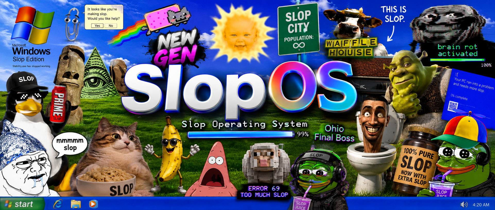

# SlopOS

A fake desktop operating system that runs entirely in your browser. No install, no backend, no pretending this is production software. Just open the page and suffer through a deliberately janky OS experience.

**v0** — shipping soon-ish.



> Images live in the `images/` folder locally. They are gitignored, so after cloning you will need your own copies (or grab them from whoever shipped you this).

---

## what is this

SlopOS is a single-page web app that looks and feels like a cursed Windows desktop. You get draggable icons, resizable-ish windows, a cookie banner, a mouth that eats your feedback, and an AI assistant that confidently knows nothing.

We built it as a fun experiment — part portfolio piece, part "what if an OS was made entirely out of slop."

---

## try it

1. Clone the repo
2. Drop the image assets into `images/` (see below)
3. Open `index.html` in a browser

That is it. No build step, no npm install, no webpack config to cry over.

If you prefer a local server:

```bash
npx serve .
```

---

## features

### welcome.slop
Your onboarding experience. You type your name by dragging a slider through the alphabet — like picking a volume level, but worse. Supports uppercase, lowercase (via a toggle), numbers, and spaces. Max 14 characters. Your name saves to `localStorage` so SlopOS remembers you.

### feedback.slop
Write feedback into a giant mouth. Click to open it, type your thoughts, hit feed, and watch it chew with a full eating animation. Once digested, your feedback spawns as a file icon on the desktop (named `feedback1`, `feedback2`, etc.). Click any file to read it on crumpled paper.

### delete apps (the gamble)
Right-click any desktop icon and hit delete. A spin wheel decides your fate:

- **50%** — actually deleted
- **50%** — duplicated instead

Yes, it is 50%. Not 0.5. Trust the wheel.

### cookies
A cookie consent banner appears on first visit. Both buttons work. One of them lies on hover. Your choice is saved so it does not nag you again.

### slop clippy
An edgy take on the classic paperclip assistant. Ask him anything and he will think very hard before telling you he has no idea. He animates through a few frames, hides for a while, then comes back like nothing happened.

### decoy apps
Trash.slop, AI.exe, and Memes.dll exist to waste your time. They rickroll you. You were warned.

### change background
There is a button. It does not work. Click it five times and you will find out why.

---

## how we built it

Everything is vanilla — **HTML**, **CSS**, and **JavaScript**. No frameworks, no React, no build pipeline. We wanted it to feel like something you could have coded in 2003 if you had worse taste and more free time.

### structure

```
SlopOS/
├── index.html      # markup, windows, desktop layout
├── styles.css      # all the neon purple chaos
├── script.js       # logic, drag, storage, animations
└── images/         # assets (gitignored)
    ├── bg.jpg          # desktop wallpaper
    ├── paper.png       # crumpled paper texture for feedback files
    ├── banner.png      # readme / promo image
    └── frames/         # clippy animation frames (c1–c5)
```

### windows and dragging
Window dragging uses a simple mousedown / mousemove / mouseup pattern (borrowed from the classic w3schools approach). Each window has a header bar as the drag handle. Clicking brings a window to the front via `z-index`.

Desktop icons use the same drag logic but with a click-vs-drag threshold — if you move less than a few pixels, it counts as a click and opens the app.

### persistence
We use `localStorage` for almost everything:

| key | what it stores |
|-----|----------------|
| `sloposUser` | your typed name |
| `sloposCookies` | cookie banner dismissed |
| `sloposFeedbackFiles` | array of eaten feedback |
| `sloposIconPos` | icon positions on desktop |
| `sloposHiddenIcons` | icons you actually deleted |
| `sloposExtraIcons` | icons that got duplicated |

So your desktop layout, feedback files, and deleted/duplicated icons survive a refresh.

### feedback flow
1. User types in the mouth textarea
2. Feed button triggers a chewing animation (CSS class + random jitter via `setInterval`)
3. After ~1.8s, text is pushed to `sloposFeedbackFiles` in localStorage
4. A new desktop icon is spawned dynamically with `createElement`
5. Clicking the icon opens a paper window with the saved text

### delete / duplicate gamble
Right-click opens a context menu. Delete kicks off a CSS spin wheel animation. `Math.random() < 0.5` picks the outcome before the spin even finishes — the wheel rotation is calculated to land on the predetermined result. Feels random. Is not.

### clippy
Five PNG frames cycle on a timer. When you ask a question, the input hides, he cycles through "uhhh" → "hummhmmm" → "idk lol", then disappears for three minutes before resetting.

### styling vibe
Comic Sans, neon green text, magenta borders, glassy header bar, Windows-style error dialog that runs away when you try to click OK. The aesthetic is intentional. We are not sorry.

---

## image setup

The `images/` folder is gitignored. You need these files for the full experience:

| file | used for |
|------|----------|
| `images/bg.jpg` | desktop background |
| `images/paper.png` | feedback paper window texture |
| `images/frames/c1.png` – `c5.png` | clippy idle animation |
| `images/banner.png` | optional, for docs / promo |

Without them the OS still runs — you just get broken images and a plain background.

---

## license

Do whatever you want with it. It is slop.

---

built with questionable judgment. see ya when v1 ships.
